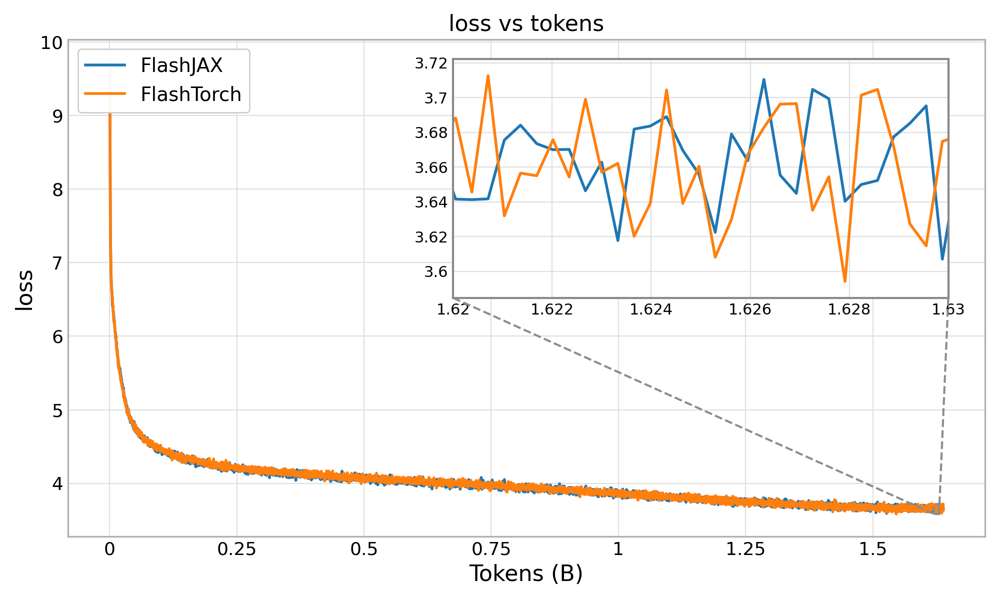
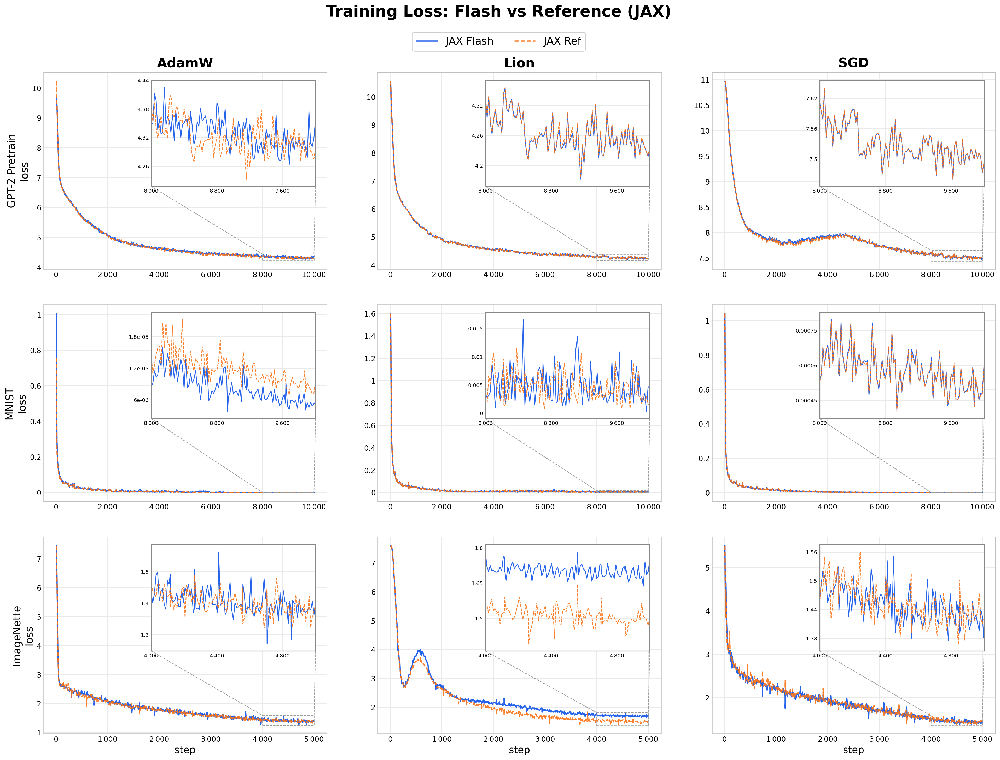
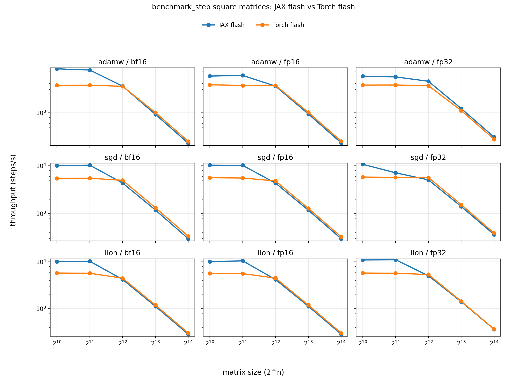
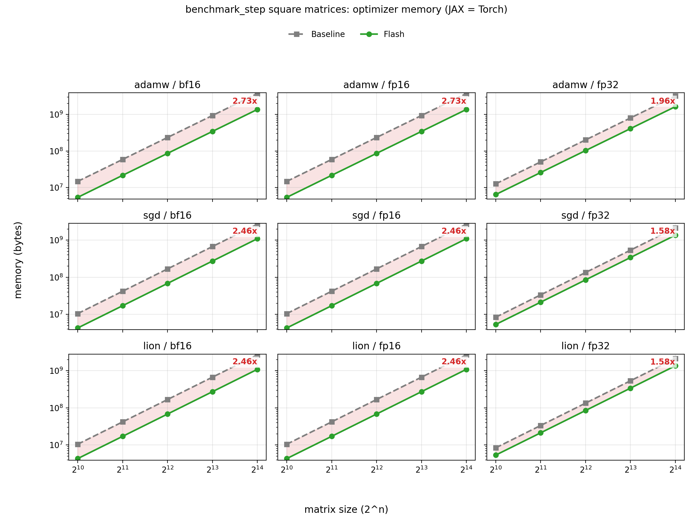
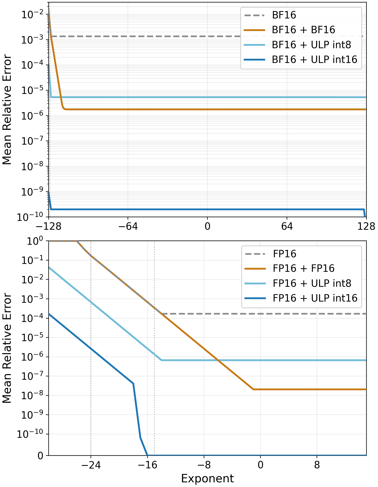

# JAX Flash

JAX implementation of [FlashOptim: Optimizers for Memory Efficient Training](https://arxiv.org/pdf/2602.23349).

Fused kernels that match the speed of the standard optimizers by
reducing memory > 2x for mixed precision training using Adam, SGD, or LION.



## Installation

```bash
uv pip install flashoptim-jax
```

## Usage

All optimizers share the same small interface: construct the optimizer, call
`init(params)`, then call `step(params, opt_state, grads)`.

```python
import jax
import jax.numpy as jnp

from flashoptim_jax import flash_adamw, flash_lion, flash_sgdw

params = {
    "w": jnp.ones((8, 8), dtype=jnp.bfloat16),
    "b": jnp.zeros((8,), dtype=jnp.float32),
}
grads = jax.tree.map(jnp.ones_like, params)

tx = flash_adamw(learning_rate=1e-3, weight_decay=1e-2)
# tx = flash_lion(learning_rate=1e-4, weight_decay=1e-2)
# tx = flash_sgdw(learning_rate=1e-2, momentum=0.9, weight_decay=1e-2)

opt_state = tx.init(params)
params, opt_state = tx.step(params, opt_state, grads)
```

For checkpointing, all optimizers expose state roundtrip helpers:

```python
from flashoptim_jax import (
    flash_adamw_state_dict,
    flash_lion_state_dict,
    flash_sgd_state_dict,
    load_flash_adamw_state_dict,
    load_flash_lion_state_dict,
    load_flash_sgd_state_dict,
)

adamw_state_dict = flash_adamw_state_dict(adamw_state)
lion_state_dict = flash_lion_state_dict(lion_state)
sgd_state_dict = flash_sgd_state_dict(sgd_state)

adamw_state = load_flash_adamw_state_dict(adamw_state_dict)
lion_state = load_flash_lion_state_dict(lion_state_dict)
sgd_state = load_flash_sgd_state_dict(sgd_state_dict)
```

There are also helpers to save and restore reconstructed FP32 master
weights. Use the same `master_weight_bits` value for restore that you used
during training:

```python
from flashoptim_jax import (
    flash_adamw,
    flash_adamw_state_dict,
    load_flash_adamw_state_dict,
)
from flashoptim_jax.compression import reconstruct_weights, set_fp32_params

tx = flash_adamw(learning_rate=1e-3, weight_decay=1e-2, master_weight_bits=24)
opt_state = tx.init(params)
params, opt_state = tx.step(params, opt_state, grads)

checkpoint = {
    "params_fp32": reconstruct_weights(params, opt_state.ecc),
    "opt_state": flash_adamw_state_dict(opt_state),
}

# ... save `checkpoint` with your preferred checkpoint library ...

restored_opt_state = load_flash_adamw_state_dict(checkpoint["opt_state"])
restored_params, restored_ecc = set_fp32_params(
    checkpoint["params_fp32"],
    param_template=params,
    master_weight_bits=24,
)
restored_opt_state = restored_opt_state._replace(ecc=restored_ecc)
params = restored_params
```

## Benchmarks

### End-to-end correctness

Below are training loss curves comparing the Flash optimizer versus an `optax` reference,
for AdamW, LION, and SGD across 3 benchmarks: GPT-2 pretraining, MNIST, and ImageNet
(each with its own architecture).



Note that LION on ImageNet diverges between the two: this is also the case with the
original Pytorch implementation. PyTorch loss curves match these curves, ommitted for
clarity.

```bash
# To re-produce runs
bash examples/run_benchmark.sh [gpt2|mnist|imagenette]

# To re-make the plot
python examples/plot_all_benchmarks_3x3.py [--jax-only]
```

### Throughput and memory savings

The JAX kernels are slightly slower at large matrix multiplications (with 10%), but significantly faster for smaller matrices due to less kernel launch overhead (> 2x for matrices 2048x2048 and below).





```bash
# Run Torch/JAX Flash/reference on many different matrix sizes
bash examples/benchmark_square_step_all.sh

# Plot the results
python examples/plot_benchmark_step_logs.py \
    --input-dir examples/out/benchmark_step_square \
    --output benchmark_timings.png \
    --memory-output benchmark_memory.png \
    --log --flash-only
```

## Reproducing Figure 3

To reproduce the FP32 reconstruction-error plot from `flashoptim.tex`, run:

```bash
python examples/plot_reconstruction_error.py --output compression_comparison_jax.png
```



## Next steps

Implement Pallas TPU kernels so this is fast on TPUs :)
